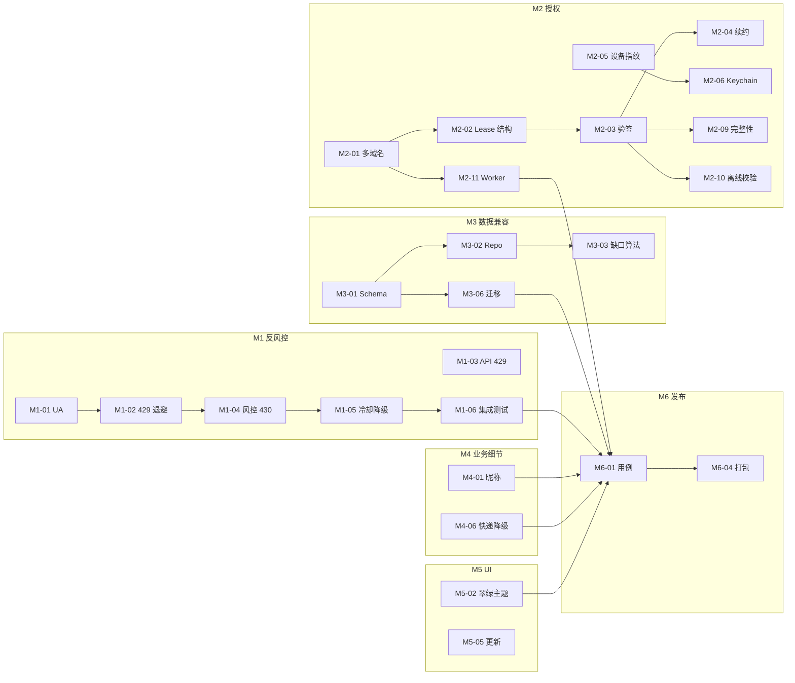

# TLS-shipinhao 5.1.0 功能补齐 — 任务卡片集

> **来源 PRD**：`docs/功能补齐PRD_与原版对齐.md`（v1.0）  
> **目标版本**：Rust/Vue `5.1.0`，对齐 Python `4.3.0`  
> **卡片总数**：43 张（6 Epic × M1–M6）  
> **适配**：可直接拷贝到 Jira / Linear / Notion（支持 Markdown 导入）  
> **生成日期**：2026-04-17

---

## 目录

- [一、总览](#一总览)
  - [1.1 Epic 与里程碑](#11-epic-与里程碑)
  - [1.2 卡片索引表](#12-卡片索引表)
  - [1.3 标签体系](#13-标签体系)
  - [1.4 关键依赖关系图](#14-关键依赖关系图)
  - [1.5 使用说明](#15-使用说明)
- [二、M1 反风控（Week 1–3）](#二m1-反风控week-1-3)
- [三、M2 授权安全（Week 4–7）](#三m2-授权安全week-4-7)
- [四、M3 数据兼容（Week 8–10）](#四m3-数据兼容week-8-10)
- [五、M4 业务细节（Week 11–13）](#五m4-业务细节week-11-13)
- [六、M5 UI 还原（Week 14–16）](#六m5-ui-还原week-14-16)
- [七、M6 回归发布（Week 17–18）](#七m6-回归发布week-17-18)
- [附录 A：Python → Rust 文件映射](#附录-apython--rust-文件映射)
- [附录 B：风险登记表](#附录-b风险登记表)

---

## 一、总览

### 1.1 Epic 与里程碑

| Epic | 名称 | 周期 | 卡片数 | 人日合计 | 关键产出 |
|---|---|---|---|---|---|
| **M1** | 反风控 | Week 1–3 | 6 | 15 | 平台化 UA、指数退避、风控降级 |
| **M2** | 授权安全 | Week 4–7 | 11 | 34 | Lease、Ed25519、设备指纹、Keychain、完整性校验 |
| **M3** | 数据兼容 | Week 8–10 | 7 | 18 | 4 表 Schema、缺口算法、Dirty 检测、旧版迁移 |
| **M4** | 业务细节 | Week 11–13 | 8 | 18 | 智能昵称、策略分级、快递降级、可回复期 |
| **M5** | UI 还原 | Week 14–16 | 7 | 20 | 翠绿主题、UI 缩放、多布局、在线更新 |
| **M6** | 回归发布 | Week 17–18 | 4 | 14 | 用例矩阵、真实数据比对、打包发布 |
| **合计** | — | 18 周 | **43** | **~119** | — |

> 估时口径：单人日按 6 小时净编码 / 调试算，已预留约 20% 联调与评审开销。

### 1.2 卡片索引表

| ID | 标题 | 类型 | 优先级 | 估时 | 依赖 |
|---|---|---|---|---|---|
| M1-01 | 平台化 User-Agent 切换 | Task | P0 | 2 | — |
| M1-02 | HTTP 429 指数退避重试 | Task | P0 | 3 | M1-01 |
| M1-03 | API 级限流（code=429）重试 | Task | P0 | 1 | M1-02 |
| M1-04 | 风控 code=430 / 异常行为检测 | Task | P0 | 2 | M1-02 |
| M1-05 | 冷却 + 极速降级模式 | Story | P0 | 4 | M1-04 |
| M1-06 | 反风控集成测试 | Task | P1 | 3 | M1-05 |
| M2-01 | 多域名容灾 HTTP 客户端 | Task | P0 | 3 | — |
| M2-02 | Lease 数据结构 & 常量 | Task | P0 | 2 | M2-01 |
| M2-03 | LeaseVerifier 实现（Ed25519） | Task | P0 | 4 | M2-02 |
| M2-04 | refresh_lease_if_due 续约逻辑 | Task | P0 | 2 | M2-03 |
| M2-05 | 设备指纹三平台采集 | Task | P0 | 5 | — |
| M2-06 | Keychain / Credential Manager 封装 | Task | P0 | 3 | M2-05 |
| M2-07 | 加密文件后备存储（Keychain 降级） | Task | P1 | 2 | M2-06 |
| M2-08 | 任务级授权 authorize_task | Story | P1 | 3 | M2-04 |
| M2-09 | 完整性校验 Manifest 流水 | Task | P0 | 4 | M2-03 |
| M2-10 | 本地离线授权校验 | Task | P0 | 2 | M2-03, M2-06 |
| M2-11 | Worker 端授权 API 对接 | Spike+Task | P0 | 4 | M2-01, M2-03 |
| M3-01 | SQLite 4 表 Schema 补齐 | Task | P0 | 3 | — |
| M3-02 | OrderCacheRepository 接口重构 | Task | P0 | 3 | M3-01 |
| M3-03 | 缺口补齐算法 get_missing_segments | Task | P0 | 3 | M3-02 |
| M3-04 | Dirty sale_param 检测与自动重建 | Task | P1 | 2 | M3-02 |
| M3-05 | fetch_full_scan_orders 全量扫描 | Story | P1 | 2 | M3-03 |
| M3-06 | LegacyPythonMigrator 迁移器 | Story | P0 | 3 | M3-01 |
| M3-07 | 首次启动迁移引导 UI | Story | P1 | 2 | M3-06 |
| M4-01 | 智能昵称匹配 similarity_percent | Task | P0 | 4 | — |
| M4-02 | 匹配策略分级 MatchStrategy | Task | P1 | 2 | M4-01 |
| M4-03 | 通用昵称过滤 | Task | P2 | 1 | M4-01 |
| M4-04 | 差评可回复期检测 | Task | P1 | 2 | — |
| M4-05 | 品退 reason 字段补齐 | Task | P1 | 2 | — |
| M4-06 | 快递公司自动降级 | Story | P0 | 3 | — |
| M4-07 | 物流快照保留（仅改 waybillId） | Task | P0 | 2 | M4-06 |
| M4-08 | initShipData → orderDetail 回退 | Task | P1 | 2 | M4-07 |
| M5-01 | 品牌信息还原（窗口标题、作者、图标） | Task | P0 | 1 | — |
| M5-02 | 翠绿主题 Tailwind 变量集 | Task | P0 | 4 | M5-01 |
| M5-03 | UI 缩放 composable | Task | P1 | 2 | M5-02 |
| M5-04 | 多布局自适应 composable | Task | P1 | 4 | M5-02 |
| M5-05 | 在线更新服务 + check_for_update | Story | P1 | 3 | — |
| M5-06 | UpdateBanner 组件 + 事件推送 | Task | P1 | 2 | M5-05 |
| M5-07 | 前端类型对齐 + 全局 UX 走查 | Task | P1 | 4 | M5-02, M5-04 |
| M6-01 | 40 项验收用例矩阵 | Task | P0 | 5 | 全部 |
| M6-02 | 真实数据比对测试 | Task | P0 | 3 | M3-06 |
| M6-03 | 性能压测与指标校验 | Task | P1 | 2 | 全部 |
| M6-04 | 打包 / 灰度发布 | Story | P0 | 4 | M6-01 |

### 1.3 标签体系

以下标签为 Jira/Linear 建议使用的多维标签，导入时按需映射：

- **Epic**：`epic:M1` `epic:M2` `epic:M3` `epic:M4` `epic:M5` `epic:M6`
- **模块**：`area:license` `area:order-sync` `area:review` `area:delivery` `area:cookie` `area:security` `area:ui` `area:worker` `area:migration`
- **层级**：`layer:rust-core` `layer:tauri-cmd` `layer:vue-ui` `layer:worker`
- **风险**：`risk:critical`（数据/授权正确性）`risk:high`（风控相关）`risk:medium` `risk:low`
- **性质**：`type:story` `type:task` `type:tech-debt` `type:spike`
- **平台**：`platform:macos` `platform:windows` `platform:cross`

### 1.4 关键依赖关系图

### 1.5 使用说明

- **Jira 导入**：推荐使用 CSV → Jira Issue Importer，把"ID / 标题 / 类型 / 优先级 / 估时 / 标签"做映射；描述直接粘贴本卡片的"用户故事 / 实现要点 / 验收标准 / 测试计划"
- **Linear 导入**：Linear 的 Markdown 粘贴支持较好，可直接以 H3 `###` 分卡、每张卡复制描述块
- **Story Point 换算参考**：1 人日 ≈ 1 SP；遇到 Spike 建议单独 2 SP timebox
- **AC 写法**：本文档用 Checklist 风格，符合 Jira/Linear/GitHub Issue 的标准 markdown 渲染

---

## 二、M1 反风控（Week 1–3）

**Epic 目标**：让订单/评价抓取在平台限流与风控下具备自愈能力，不再因偶发风控导致任务彻底失败。

---

### M1-01 平台化 User-Agent 切换

| 字段 | 内容 |
|---|---|
| 类型 | Task |
| Epic | M1 反风控 |
| 优先级 | **P0** |
| 估时 | 2 人日 |
| 依赖 | — |
| 标签 | `epic:M1` `area:security` `layer:rust-core` `platform:cross` `risk:high` |

**技术目标**  
把访问微信小店接口的 `User-Agent` 与 `sec-ch-ua-platform` 按宿主平台自动切换，与 Python 4.3.0 保持一致，降低被风控识别为异常客户端的概率。

**范围 & 实现要点**
- 新增 `crates/security-core/src/http_headers.rs`
- 常量：`WINDOWS_UA`、`MACOS_UA`、`get_user_agent()`、`get_sec_ch_ua_platform()`
- 在 `apps/desktop/src/adapters/` 下所有 HTTP 客户端（`http_order_search.rs`、`http_review_source.rs`、`http_delivery_gateway.rs`、`http_quality_refund_source.rs`、`http_license_client.rs`）初始化请求头时统一调用
- 保留覆盖能力：允许注入自定义 UA，方便单元测试

**验收标准 (AC)**
- [ ] macOS 下实际请求 `User-Agent` 为 `Mozilla/5.0 (Macintosh; Intel Mac OS X 10_15_7) ... Chrome/144.0.0.0 ...`
- [ ] Windows 下实际请求 `User-Agent` 为 `Mozilla/5.0 (Windows NT 10.0; Win64; x64) ... Chrome/144.0.0.0 ...`
- [ ] `sec-ch-ua-platform` header 为 `"macOS"` / `"Windows"`
- [ ] 所有 adapter 请求都走同一个 UA 源，无硬编码散落

**测试计划**
- 单元测试：`#[cfg]` 分支断言返回值
- 集成测试：Mock HTTP Server 捕获请求头做断言

**涉及文件**
- `crates/security-core/src/http_headers.rs` (新增)
- `apps/desktop/src/adapters/http_*.rs` (修改)

**风险 / 澄清点**
- Chrome 144 的 UA 串随时间需要维护；建议 `crates/security-core` 暴露一个常量文件，年度更新一次

---

### M1-02 HTTP 429 指数退避重试

| 字段 | 内容 |
|---|---|
| 类型 | Task |
| Epic | M1 反风控 |
| 优先级 | **P0** |
| 估时 | 3 人日 |
| 依赖 | M1-01 |
| 标签 | `epic:M1` `area:order-sync` `layer:rust-core` `risk:high` |

**技术目标**  
订单分页抓取遇到 `HTTP 429` 时，按 `2^n` 秒（2/4/8…）指数退避，最多重试 3 次，期间把进度消息向前端 `on_progress` 回调透传，避免前端误判为卡死。

**范围 & 实现要点**
- `crates/desktop-services/src/order_fetcher.rs`（新增模块）
  - `retry_order_search_on_limit(data, headers, page_index, api_level, on_progress)`
  - 常量：`RATE_LIMIT_RETRY_COUNT: u32 = 3`
- 把现有 `order_sync_service.rs` / `review_match_flow.rs` 里对 HTTP 状态码的处理抽取到 fetcher
- 进度消息格式：`"第 X 页触发频率限制，等待 Y 秒后重试..."`

**AC**
- [ ] 模拟 3 次 429 后 200 → 最终成功
- [ ] 4 次 429 → 抛出 `FetchError::RateLimitExhausted`
- [ ] 等待时长依次为 2s / 4s / 8s，允许 ±0.3s 抖动
- [ ] 等待期间 `stop_flag` 能中断退避

**测试计划**
- 单元测试：使用 `wiremock` 或自定义 trait 注入的 `OrderSearchSource`
- Snapshot：断言 `on_progress` 被调用次数与参数

**涉及文件**
- `crates/desktop-services/src/order_fetcher.rs`（新）
- `crates/desktop-services/src/order_sync_service.rs`（接入）

**风险 / 澄清点**
- `stop_flag` 需要 `Arc<AtomicBool>` 串起来；沿用现有 `OrderSyncService` 的停止协议即可

---

### M1-03 API 级限流（code=429）重试

| 字段 | 内容 |
|---|---|
| 类型 | Task |
| Epic | M1 反风控 |
| 优先级 | **P0** |
| 估时 | 1 人日 |
| 依赖 | M1-02 |
| 标签 | `epic:M1` `area:order-sync` `layer:rust-core` |

**技术目标**  
微信小店接口即便 HTTP 200 也可能在 JSON 里返回 `code: 429`，需要同样走指数退避。

**范围 & 实现要点**
- 在 `retry_order_search_on_limit` 中加 `api_level: bool` 分支
- 进度消息追加 `(API)` 标识：`"第 X 页触发频率限制(API)，等待 Y 秒..."`
- 共用 M1-02 的计数与 stop_flag

**AC**
- [ ] `result.code == 429` → 触发 API 级退避
- [ ] `respStatusCode == 429` → 同上
- [ ] 前端进度消息包含 `(API)` 标识
- [ ] 与 HTTP 429 合并退避计数，不超过 3 次

**涉及文件**
- `crates/desktop-services/src/order_fetcher.rs`

---

### M1-04 风控 code=430 / 异常行为检测

| 字段 | 内容 |
|---|---|
| 类型 | Task |
| Epic | M1 反风控 |
| 优先级 | **P0** |
| 估时 | 2 人日 |
| 依赖 | M1-02 |
| 标签 | `epic:M1` `area:order-sync` `risk:critical` |

**技术目标**  
识别平台风控信号（`code=430`、`respStatusCode=430`、`msg` 中包含"异常行为"/"拒绝访问"），触发后续的冷却 + 降级流程（M1-05）。

**范围 & 实现要点**
- `fn is_risk_control_result(result: &serde_json::Value) -> bool`
- 独立放在 `crates/desktop-services/src/order_fetcher.rs` 中，方便单测
- 任意一条匹配即判风控；message 判断不分大小写

**AC**
- [ ] `{ "code": 430 }` → true
- [ ] `{ "respStatusCode": 430 }` → true
- [ ] `{ "msg": "检测到异常行为" }` → true
- [ ] `{ "msg": "拒绝访问，请稍后" }` → true
- [ ] 正常返回 `{ "code": 0 }` → false
- [ ] 单元测试覆盖 5+ 场景

**测试计划**
- 纯函数单测，100% 分支覆盖

**涉及文件**
- `crates/desktop-services/src/order_fetcher.rs`

---

### M1-05 冷却 + 极速降级模式

| 字段 | 内容 |
|---|---|
| 类型 | Story |
| Epic | M1 反风控 |
| 优先级 | **P0** |
| 估时 | 4 人日 |
| 依赖 | M1-04 |
| 标签 | `epic:M1` `area:order-sync` `layer:rust-core` `layer:tauri-cmd` `risk:critical` |

**用户故事**  
**作为** 视频号小店卖家  
**我希望** 命中平台风控时系统能自动冷却并切换到"极速模式"（更慢更保守）继续抓取  
**所以** 单次同步不会因风控而彻底失败、我的订单能尽量抓全

**范围 & 实现要点**
- `OrderFetcher::fetch_by_page_normal`：3 worker × 0.3s 间隔
- `OrderFetcher::fetch_by_page_risk_mode`：1 worker × 2.0s 间隔
- `get_orders_for_cache` 主流程：normal 抓取 → 命中 `FetchError::RiskControl { partial_orders }` → 60 秒冷却（10 秒步长打印倒计时）→ `fetch_by_page_risk_mode` 重试 → 合并去重（`deduplicate_orders_by_id`）
- 常量：`ORDER_WINDOW_WORKERS=3`、`ORDER_RISK_WINDOW_WORKERS=1`、`FETCH_PAGE_INTERVAL_SECONDS=0.3`、`ORDER_RISK_PAGE_INTERVAL_SECONDS=2.0`、`COOLDOWN_SECS=60`
- 事件：新增 `risk-control-cooldown` Tauri 事件，payload `{ remaining_secs, reason }`
- 冷却期间尊重 `stop_flag`

**AC**
- [ ] 正常模式命中风控 → 进入 60 秒冷却并打印倒计时（10/20/.../60）
- [ ] 冷却完成 → 自动切换极速模式，继续从上次 page 抓
- [ ] 极速模式再次风控 → 返回已有数据 + 警告消息 `"本次抓取触发平台风控，已自动降级到极速模式"`
- [ ] 极速模式连续失败 + `partial_orders` 为空 → `FetchError::Fatal("平台风控持续触发，请稍后重试")`
- [ ] 冷却期间用户点击"停止"可立即中断
- [ ] 前端 `OrderSyncView` 可订阅 `risk-control-cooldown` 事件并展示

**测试计划**
- 单元：注入风控 response、校验 worker 数/间隔/重试次数
- 集成：模拟真实打压，验证整体时序

**涉及文件**
- `crates/desktop-services/src/order_fetcher.rs`
- `crates/desktop-services/src/order_sync_service.rs`
- `apps/desktop/src/commands/order.rs`（事件推送）
- `ui/src/views/OrderSyncView.vue`（事件订阅 + UI 提示）

**风险 / 澄清点**
- 极速模式仍命中风控的错误分类，需要与产品确认："此类订单不可抓"是否仍算成功（仅警告）
- 冷却时长是否随风险等级变化？本迭代先固定 60s，后续可与 `RuntimeGrant.risk_level` 联动

---

### M1-06 反风控集成测试

| 字段 | 内容 |
|---|---|
| 类型 | Task |
| Epic | M1 反风控 |
| 优先级 | P1 |
| 估时 | 3 人日 |
| 依赖 | M1-05 |
| 标签 | `epic:M1` `area:order-sync` `type:tech-debt` |

**技术目标**  
为反风控链路建立可重复运行的回归测试集，CI 必跑。

**范围 & 实现要点**
- `tests/order_fetcher_integration.rs` 或 `crates/desktop-services/tests/`
- Mock 服务：先 2 次 429 → 200；先 3 次 429 → 超限；先 1 次 430 → 冷却 → 正常
- 快照测试进度消息列表

**AC**
- [ ] CI 能在 < 30 秒内跑完整个反风控集成测试（冷却时间用 mock 缩短）
- [ ] 覆盖场景：HTTP 429、API 429、code 430、msg 命中、混合场景
- [ ] 断言：返回结果的订单数量、去重后的唯一性、警告消息一致

**涉及文件**
- `crates/desktop-services/tests/order_fetcher_integration.rs`

---

## 三、M2 授权安全（Week 4–7）

**Epic 目标**：把授权协议升级到 Protocol v3（Lease + Ed25519 + 任务级授权），所有关键凭证落地到系统安全存储，并在每次授权/续约前做二进制完整性校验。

---

### M2-01 多域名容灾 HTTP 客户端

| 字段 | 内容 |
|---|---|
| 类型 | Task |
| Epic | M2 授权安全 |
| 优先级 | **P0** |
| 估时 | 3 人日 |
| 依赖 | — |
| 标签 | `epic:M2` `area:license` `layer:rust-core` `risk:high` |

**技术目标**  
授权服务的所有 HTTP 调用按 `LICENSE_API_BASE_URLS` 顺序尝试；网络错误（连接/超时）自动切换下一个域名，业务错误（HTTP 4xx/5xx）不切换直接抛。

**范围 & 实现要点**
- 将 `crates/license-service/src/lib.rs`（29.4K 单文件）拆分，新增：
  - `config.rs`：`LICENSE_API_BASE_URLS`、`LICENSE_API_TIMEOUT_SECS=10`、`LICENSE_PROTOCOL_VERSION=3`、`LICENSE_PUBLIC_KEY_B64`、`LICENSE_LEASE_RENEWAL_HOURS=24`、`LICENSE_LEASE_HARD_EXPIRY_HOURS=72`、`LICENSE_RUNTIME_GRANT_MINUTES=30` 等
  - `http_client.rs`：`MultiDomainClient::post_json<T, R>`，顺序尝试，记录 `last_network_err`
- 错误类型：`LicenseError::HttpError(StatusCode)`、`NetworkError(String)`、`AllDomainsFailed(String)`

**AC**
- [ ] 4 个基础域名按 `sphapi.199908.top → ccwu.cc → us.ci → eu.cc` 顺序尝试
- [ ] 单域名超时/连接失败 → 自动切下一个
- [ ] 首域名返回 HTTP 401 → 立即返回 `HttpError(401)`，不切换
- [ ] 所有域名都网络失败 → `AllDomainsFailed`，错误里包含最后一次的错误描述
- [ ] 单个请求硬超时 10s

**测试计划**
- 单测：构建 4 个 mock server，逐个关停验证切换
- 单测：返回 4xx → 断言不切换

**涉及文件**
- `crates/license-service/src/config.rs`（新）
- `crates/license-service/src/http_client.rs`（新）
- `crates/license-service/src/lib.rs`（拆分）

**风险 / 澄清点**
- `reqwest` 超时与 tokio runtime 的关系；注意不要在多次 clone 中丢失 client pool

---

### M2-02 Lease 数据结构 & 常量

| 字段 | 内容 |
|---|---|
| 类型 | Task |
| Epic | M2 授权安全 |
| 优先级 | **P0** |
| 估时 | 2 人日 |
| 依赖 | M2-01 |
| 标签 | `epic:M2` `area:license` `layer:rust-core` |

**技术目标**  
定义与 Python 版 Protocol v3 完全一致的 Lease / RuntimeState / RuntimeGrant 数据模型。

**范围 & 实现要点**
- `crates/license-service/src/lease.rs`：`LeasePayload`（含 `kind="license_lease"`、`license_key`、`device_id`、`issued_at`、`exp`、`renew_after`、`task_policy: Vec<String>`、`risk_level`）
- `crates/license-service/src/runtime.rs`：`RuntimeState`、`RuntimeGrant`、`LicenseReason`（10 个枚举值）、`ALLOWED_LOCAL_REASONS = [Ok, RenewalDue]`
- `crates/license-service/src/tasks.rs`：`LICENSE_TASK_REVIEW_FIND` 等 5 个任务常量 + `SUPPORTED_TASKS` 数组
- 所有结构 `#[serde(rename_all="snake_case")]`

**AC**
- [ ] `LicenseReason` 的 JSON 序列化是 snake_case（`device_mismatch` 等）
- [ ] `ALLOWED_LOCAL_REASONS` 与 Python 版一致，仅允许 `ok` + `renewal_due`
- [ ] 5 个任务类型常量完整
- [ ] `RuntimeState` 可通过 Tauri 命令原样返回给前端

**涉及文件**
- `crates/license-service/src/lease.rs`
- `crates/license-service/src/runtime.rs`
- `crates/license-service/src/tasks.rs`
- `crates/api-contracts/src/lib.rs`（新增前端契约）
- `ui/src/types/license.ts`（前端类型 + `LICENSE_STATE_LABELS`）

---

### M2-03 LeaseVerifier 实现（Ed25519）

| 字段 | 内容 |
|---|---|
| 类型 | Task |
| Epic | M2 授权安全 |
| 优先级 | **P0** |
| 估时 | 4 人日 |
| 依赖 | M2-02 |
| 标签 | `epic:M2` `area:license` `area:security` `risk:critical` |

**技术目标**  
实现 Lease Token（`base64url(payload).base64url(signature)`）的 Ed25519 验签与业务字段校验。

**范围 & 实现要点**
- 依赖：`ed25519-dalek = "2"`、`base64 = "0.22"`
- `LeaseVerifier::new()`：从 `LICENSE_PUBLIC_KEY_B64` 载入 `VerifyingKey`
- `LeaseVerifier::verify(token, expected_device_id, allow_expired)`
- 错误：`LeaseError::InvalidFormat / InvalidSignature / InvalidKind / DeviceMismatch / Expired`
- `kind` 必须为 `"license_lease"`

**AC**
- [ ] 签名正确 + 设备一致 + 未过期 → 返回 `LeasePayload`
- [ ] 篡改 payload（任一字节）→ `InvalidSignature`
- [ ] `device_id` 不匹配 → `DeviceMismatch`
- [ ] `exp < now` 且 `allow_expired=false` → `Expired`
- [ ] `allow_expired=true` 时，过期 Lease 也能解出 payload（供"已过期但展示"场景）
- [ ] `kind != "license_lease"` → `InvalidKind`
- [ ] 单元测试覆盖 7+ 分支

**测试计划**
- 使用测试私钥生成多组样本（正常/过期/篡改签名/篡改 payload/错设备）
- 在 `tests/fixtures/` 存一组固定的 Lease 字符串

**涉及文件**
- `crates/license-service/src/lease.rs`
- `crates/license-service/src/error.rs`
- `crates/license-service/Cargo.toml`（加依赖）

**风险 / 澄清点**
- 公钥 `LICENSE_PUBLIC_KEY_B64 = "H0KTidHIXV0nvzkUNmssrx5t5IrUvEQi1WVelkuCJm8"` 与 Worker（M2-11）签名使用的私钥是否一致？上线前必须联调一轮

---

### M2-04 refresh_lease_if_due 续约逻辑

| 字段 | 内容 |
|---|---|
| 类型 | Task |
| Epic | M2 授权安全 |
| 优先级 | **P0** |
| 估时 | 2 人日 |
| 依赖 | M2-03 |
| 标签 | `epic:M2` `area:license` `layer:tauri-cmd` |

**技术目标**  
在 `now >= renew_after && now < exp` 窗口内，调 Worker `/api/lease/refresh` 获取新 Token，覆盖本地存储；`now >= exp` 直接报 `LeaseExpired`。

**范围 & 实现要点**
- `refresh_lease_if_due(current: &LeasePayload, client: &MultiDomainClient) -> Result<Option<String>>`
- 返回 `Ok(None)` 表示"尚未到期无需续约"；`Ok(Some(new_token))` 表示"已换新"
- Tauri 命令 `refresh_lease_if_due` → 写回 Keychain（M2-06）→ 触发事件 `license-state-changed`

**AC**
- [ ] `now < renew_after` → 返回 `None`
- [ ] `renew_after <= now < exp` → 调用 Worker，返回新 token
- [ ] `now >= exp` → `LicenseError::LeaseExpired`
- [ ] Worker 返回网络错误 → 不覆盖旧 Lease
- [ ] 续约成功后 `license-state-changed` 事件包含最新 `RuntimeState`

**涉及文件**
- `crates/license-service/src/lease.rs`
- `apps/desktop/src/commands/license.rs`
- `ui/src/stores/license.ts`（前端订阅事件刷新 UI）

---

### M2-05 设备指纹三平台采集

| 字段 | 内容 |
|---|---|
| 类型 | Task |
| Epic | M2 授权安全 |
| 优先级 | **P0** |
| 估时 | 5 人日 |
| 依赖 | — |
| 标签 | `epic:M2` `area:security` `platform:cross` `risk:high` |

**技术目标**  
在 macOS / Windows / Linux 上稳定采集硬件指纹，归一为 `SHA256(raw)[..8]` 的 16 位 hex 字符串。

**范围 & 实现要点**
- `crates/security-core/src/device_id.rs`
  - macOS：`ioreg -rd1 -c IOPlatformExpertDevice` 解析 `IOPlatformSerialNumber`
  - Windows：`wmic csproduct get UUID` → 失败回退 `powershell -Command "(Get-CimInstance Win32_ComputerSystemProduct).UUID"`
  - Linux：`/etc/machine-id` / `/var/lib/dbus/machine-id`
  - 兜底：`sysinfo::System::host_name/cpu_arch/name` 组合
- `get_device_id()` 返回 `hex(sha256(raw))[..16]`

**AC**
- [ ] macOS 实机多次调用返回同一 16 位 hex
- [ ] Windows 10/11 实机多次调用返回同一 16 位 hex
- [ ] 各平台硬件采集失败时能降级到 `fallback_fingerprint`
- [ ] macOS 沙箱禁用 `ioreg` 时不会 panic，走兜底
- [ ] 输出长度恒为 16

**测试计划**
- CI：mac/win/linux 分别跑单测
- 手工：在真机记录 `raw → hashed` 样本

**涉及文件**
- `crates/security-core/src/device_id.rs`
- `crates/security-core/Cargo.toml`（`sysinfo` / `sha2` / `hex`）

**风险 / 澄清点**
- 企业 MDM 环境下 `ioreg` 可能返回空值；需设计可展示"兜底指纹"标识用于排查

---

### M2-06 Keychain / Credential Manager 封装

| 字段 | 内容 |
|---|---|
| 类型 | Task |
| Epic | M2 授权安全 |
| 优先级 | **P0** |
| 估时 | 3 人日 |
| 依赖 | M2-05 |
| 标签 | `epic:M2` `area:security` `platform:cross` `risk:high` |

**技术目标**  
统一封装对系统凭据管理器的 set/get/delete，用于存放 Lease、RuntimeBundle 等敏感材料。

**范围 & 实现要点**
- `apps/desktop/src/adapters/secure_storage.rs`
- 依赖 `keyring = "3"`
- 常量：`KEYCHAIN_SERVICE = "com.tuoling.tls-shipinhao.runtime"`、`KEYCHAIN_ACCOUNT = "runtime_bundle"`
- API：`new() / set(&str) / get() -> Option<String> / delete()`
- `NoEntry` 视为 `Ok(None)`，而非错误

**AC**
- [ ] macOS 调用 `security find-generic-password -s com.tuoling.tls-shipinhao.runtime` 能查到
- [ ] Windows 在 Credential Manager 中能查到条目
- [ ] 删除后再次读取 → 返回 `Ok(None)`
- [ ] 并发 set/get 不出现竞态（keyring 本身线程安全，但要在测试里验证）

**测试计划**
- 单测：set / get / delete 闭环
- 手工：macOS 钥匙串 GUI 可见；Windows 凭据管理器可见

**涉及文件**
- `apps/desktop/src/adapters/secure_storage.rs`
- `apps/desktop/Cargo.toml`

---

### M2-07 加密文件后备存储

| 字段 | 内容 |
|---|---|
| 类型 | Task |
| Epic | M2 授权安全 |
| 优先级 | P1 |
| 估时 | 2 人日 |
| 依赖 | M2-06 |
| 标签 | `epic:M2` `area:security` `risk:medium` |

**技术目标**  
当 Keychain/CredMan 不可用（CI / 无 seahorse 的 Linux / 某些企业环境）时降级到"本地加密文件"，使用设备指纹派生 AES-256-GCM 密钥。

**范围 & 实现要点**
- `SecureStorage::new()` 内部先试 keyring；失败/NoBackend 时回退到 `EncryptedFileStorage`
- 文件路径：`<app-runtime-dir>/runtime_bundle.enc`
- 依赖：`aes-gcm = "0.10"`、`argon2` or `hkdf` 做 KDF（选 `hkdf`，输入 = SHA256(device_id)）
- IV 随机，文件格式 `version(1) | iv(12) | ciphertext`

**AC**
- [ ] macOS 模拟 Keychain 失败 → 自动回退加密文件
- [ ] 写入后重启仍能读取
- [ ] 文件被手工删除 → 返回 `Ok(None)`
- [ ] 设备指纹改变 → 解密失败并返回明确错误（`StorageError::DeviceChanged`）

**涉及文件**
- `apps/desktop/src/adapters/secure_storage.rs`
- `apps/desktop/src/adapters/encrypted_file_storage.rs`

**风险 / 澄清点**
- 设备指纹变化（换硬盘/主板）时的用户体验：建议"静默失败 + 引导重新激活"而非爆错

---

### M2-08 任务级授权 authorize_task

| 字段 | 内容 |
|---|---|
| 类型 | Story |
| Epic | M2 授权安全 |
| 优先级 | P1 |
| 估时 | 3 人日 |
| 依赖 | M2-04 |
| 标签 | `epic:M2` `area:license` `area:review` `area:delivery` |

**用户故事**  
**作为** 运营管理员  
**我希望** 对每一项危险操作（差评查询、批量发货等）单独下发短时令牌  
**所以** 能够精细化风控，必要时立即关闭某功能而不吊销整体授权

**范围 & 实现要点**
- `LicenseService::authorize_task(task_type: &str) -> Result<RuntimeGrant>`
- 优先用本地 Lease 的 `task_policy` 快速通过，产出一个本地自签 `grant_id`（UUID v4），有效期 30 分钟
- 当 `risk_level=high` 或策略要求联网时 → 调 Worker `/api/task/authorize`
- Grant 结果缓存 `LICENSE_RUNTIME_GRANT_MINUTES` 分钟
- 各 `commands/review.rs` / `commands/delivery.rs` / `commands/order.rs` 在入口处调用

**AC**
- [ ] `review_find` / `review_full_scan` / `quality_refund` / `batch_delivery` / `cache_manage` 5 类任务都在执行前校验
- [ ] 本地 Lease 的 `task_policy` 不含某任务时直接拒绝
- [ ] 服务端拒绝 Runtime Grant → 前端弹窗提示 `degraded_reason`
- [ ] 30 分钟内同一任务重复调用走缓存
- [ ] 后端 HTTP 请求带 `X-Grant-Id` / `X-Grant-Expire` 头

**涉及文件**
- `crates/license-service/src/authorize_task.rs`（新）
- `apps/desktop/src/commands/review.rs` / `delivery.rs` / `order.rs`
- `ui/src/composables/useReview.ts`（错误分支处理）

---

### M2-09 完整性校验 Manifest 流水

| 字段 | 内容 |
|---|---|
| 类型 | Task |
| Epic | M2 授权安全 |
| 优先级 | **P0** |
| 估时 | 4 人日 |
| 依赖 | M2-03 |
| 标签 | `epic:M2` `area:security` `risk:critical` |

**技术目标**  
启动时 + 关键业务前，依据签名 Manifest 校验关键文件的 SHA256，发现篡改立即进入 `compromised` 状态并禁用业务功能。

**范围 & 实现要点**
- `crates/security-core/src/integrity.rs`
  - `SignedManifest { payload, signature }`
  - `validate_runtime_continuity() -> Result<(), IntegrityError>`
- 常量：`INTEGRITY_MANIFEST_FILE_NAME = "integrity_manifest.json"`、单独公钥 `INTEGRITY_MANIFEST_PUBLIC_KEY`
- `canonicalize_manifest` 使用稳定序列化（按字段名排序）避免 JSON 空白差异
- 触发点：App 启动 → `refresh_lease_if_due` 前 → `authorize_task` 前
- 失败处理：
  - `RuntimeState.compromised = true`
  - Tauri 事件 `integrity-compromised`
  - 前端弹窗 + 禁用菜单

**AC**
- [ ] 正常构建产物 → 校验通过
- [ ] 手动修改 `ui/dist/index.html` 一个字节 → `FileModified("ui/dist/index.html")`
- [ ] 缺失 manifest 文件 → `IntegrityError::MissingManifest`
- [ ] Manifest 签名篡改 → `InvalidSignature`
- [ ] 触发 `integrity-compromised` 事件后，前端进入警告态并禁用所有业务按钮

**涉及文件**
- `crates/security-core/src/integrity.rs`
- `xtask/` 新增 `generate-manifest` 子命令（打包时生成并签名 manifest）
- `ui/src/components/layout/IntegrityWarning.vue`（新）

**风险 / 澄清点**
- macOS 代码签名后 `apps/desktop/desktop-app` 的 hash 会变化，需要在签名后再生成 Manifest；打包流程顺序务必确认

---

### M2-10 本地离线授权校验

| 字段 | 内容 |
|---|---|
| 类型 | Task |
| Epic | M2 授权安全 |
| 优先级 | **P0** |
| 估时 | 2 人日 |
| 依赖 | M2-03, M2-06 |
| 标签 | `epic:M2` `area:license` `layer:tauri-cmd` |

**技术目标**  
实现 `check_stored_license_local`：完全不联网情况下读取 Keychain 中的 Lease、验签、组合 `RuntimeState` 返回。

**范围 & 实现要点**
- `LicenseService::verify_local() -> RuntimeState`
- Lease 不存在 → `not_found`
- 设备不匹配 → `device_mismatch`
- 过期 → `expired`
- OK → `Ok / RenewalDue`（按 `renew_after` 判定）
- `RuntimeState.runtime_backend = "rust"`

**AC**
- [ ] 飞行模式下 App 启动仍能返回可用状态（72 小时内）
- [ ] `RuntimeState.license_expires_at` / `lease_expires_at` / `renew_after` 为 ISO8601
- [ ] `task_policy` 原样返回
- [ ] Tauri 命令 `get_license_status` 默认走 local 路径

**涉及文件**
- `crates/license-service/src/lib.rs`
- `apps/desktop/src/commands/license.rs`

---

### M2-11 Worker 端授权 API 对接

| 字段 | 内容 |
|---|---|
| 类型 | Spike + Task |
| Epic | M2 授权安全 |
| 优先级 | **P0** |
| 估时 | 4 人日 |
| 依赖 | M2-01, M2-03 |
| 标签 | `epic:M2` `area:worker` `layer:worker` `risk:critical` |

**技术目标**  
在 `backend/license-worker/`（Cloudflare Worker + D1）实现 5 个端点，与 Python 版签名协议对齐。

**范围 & 实现要点**
- 端点：
  - `POST /api/activate`：卡密 + 设备 → 发初始 Lease
  - `POST /api/verify`：校验 + 续约建议
  - `POST /api/lease/refresh`：续约换 token
  - `POST /api/lease/revoke`：管理员吊销
  - `POST /api/task/authorize`：下发 RuntimeGrant
- Ed25519 密钥存放：Worker Secret（`LEASE_PRIVATE_KEY_PEM`），客户端只验公钥
- D1 表：`licenses(key, status, activated_at, device_id, ...)` / `grants(grant_id, task, expires_at)` / `lease_audit(event, ts)`
- 限流：每 key + device 每秒 5 次
- Spike 部分：确认 Python 版当前的 request/response JSON schema，输出对照表

**AC**
- [ ] 5 个端点都能跑 e2e（wrangler dev + 客户端联调）
- [ ] 激活后客户端能完整链路工作（含 24h 续约、72h 强制重激）
- [ ] Worker 返回 429 → 客户端退避
- [ ] 审计表记录每次 activate/refresh/revoke

**涉及文件**
- `backend/license-worker/src/*`
- `backend/license-worker/wrangler.toml`
- `backend/license-worker/migrations/*.sql`
- `docs/license-protocol-v3.md`（Spike 输出）

**风险 / 澄清点**
- D1 免费额度（每日 5M 行读 / 100K 行写）是否够用，需要拉产品评估 DAU 与请求频次
- Lease 签名在 Worker 中用 WASM 做还是 Rust 原生？性能差异需要 Spike

---

## 四、M3 数据兼容（Week 8–10）

**Epic 目标**：让 Rust 版的本地缓存能力与 Python 版 1:1（4 表 Schema、缺口算法、dirty 检测），并在用户从 4.3.0 升级时自动接管老数据。

---

### M3-01 SQLite 4 表 Schema 补齐

| 字段 | 内容 |
|---|---|
| 类型 | Task |
| Epic | M3 数据兼容 |
| 优先级 | **P0** |
| 估时 | 3 人日 |
| 依赖 | — |
| 标签 | `epic:M3` `area:order-sync` `layer:rust-core` `risk:high` |

**技术目标**  
将 `SqliteOrderCache` 从单表 `orders` 扩展到 `orders / order_products / sync_state / cache_segments`，并建立索引、启用 WAL。

**范围 & 实现要点**
- `apps/desktop/src/adapters/sqlite_order_cache.rs`
- DDL 脚本独立成字符串常量，便于迁移逻辑复用
- Orders 表补齐字段：`normalized_nickname`、`is_waybill_received`、`waybill_received_time`、`is_education_order`、`openid`、`raw_source`、`updated_at`
- 索引：`idx_orders_create_time`、`idx_products_order_id`、`idx_cache_segments_scope_start`
- `PRAGMA journal_mode=WAL`

**AC**
- [ ] 全新库创建 → 4 表 + 3 索引 + WAL 模式
- [ ] 现有库从 v1(单 orders) → v2(四表) 能通过迁移自动升级
- [ ] 字段默认值与 PRD 一致（0 / '' / 'order_api'）
- [ ] 外键 `order_products.order_id → orders.order_id ON DELETE CASCADE` 生效

**测试计划**
- 单测：创建空库 → 检查表结构 / 索引
- 单测：v1 → v2 迁移

**涉及文件**
- `apps/desktop/src/adapters/sqlite_order_cache.rs`

---

### M3-02 OrderCacheRepository 接口重构

| 字段 | 内容 |
|---|---|
| 类型 | Task |
| Epic | M3 数据兼容 |
| 优先级 | **P0** |
| 估时 | 3 人日 |
| 依赖 | M3-01 |
| 标签 | `epic:M3` `area:order-sync` `layer:rust-core` |

**技术目标**  
将现 `order_cache_storage.rs`（23.8K）按仓储模式重构为 `OrderCacheRepository` trait + `SqliteOrderCacheRepository` 实现，为后续业务解耦与 Mock 铺路。

**范围 & 实现要点**
- `crates/desktop-services/src/order_cache_repository.rs`（新 trait）
- 方法：`initialize / upsert_orders / get_state / save_state / mark_segment_complete / get_complete_segments / get_missing_segments / has_dirty_sale_param / clear_all / delete_older_than / fetch_orders_in_range`
- `SqliteOrderCacheRepository` 位于 `apps/desktop/src/adapters/`
- 现有 `OrderSyncService` 改为持有 `Arc<dyn OrderCacheRepository>`

**AC**
- [ ] `OrderSyncService` 构造函数接受 `Arc<dyn OrderCacheRepository>`，不再直接依赖 sqlite
- [ ] 所有原 `order_cache_storage.rs` 的功能都迁到 trait + impl
- [ ] 单测用 Mock Repository 跑通 `OrderSyncService` 主流程

**涉及文件**
- `crates/desktop-services/src/order_cache_repository.rs`
- `crates/desktop-services/src/order_cache_storage.rs`（删除或瘦身）
- `apps/desktop/src/adapters/sqlite_order_cache.rs`
- `crates/desktop-services/src/order_sync_service.rs`

---

### M3-03 缺口补齐算法 get_missing_segments

| 字段 | 内容 |
|---|---|
| 类型 | Task |
| Epic | M3 数据兼容 |
| 优先级 | **P0** |
| 估时 | 3 人日 |
| 依赖 | M3-02 |
| 标签 | `epic:M3` `area:order-sync` |

**技术目标**  
实现 PRD §6.4 的三步算法（裁剪/合并/找缺口），参数 `merge_tolerance=120s` 与 `min_gap_width=300s`。

**范围 & 实现要点**
- 签名：`fn get_missing_segments(&self, start, end, scope, merge_tolerance, min_gap_width) -> Result<Vec<(i64, i64)>>`
- 边界：`start <= 0 || end <= 0 || start > end` → 返回空
- 裁剪：`segments.start.max(start)`、`segments.end.min(end)`，过滤 `s > e` 的无效段
- 合并：若 `gap <= merge_tolerance` 合并
- 缺口：严格按 `>= min_gap_width` 过滤

**AC**
- [ ] 无已完成段 → 返回 `[(start, end)]`
- [ ] 三段完整覆盖 → 返回 `[]`
- [ ] 两段间 60s 间隔（< tolerance）→ 合并为 1 段
- [ ] 中间 500s 缺口（> min_gap_width）→ 返回该缺口
- [ ] 中间 200s 缺口（< min_gap_width）→ 不返回
- [ ] 单元测试覆盖 10+ 边界（单段、两段、首尾、超范围、负数等）

**测试计划**
- 表驱动测试

**涉及文件**
- `crates/desktop-services/src/order_cache_repository.rs` 或独立 `order_gap_planner.rs`

---

### M3-04 Dirty sale_param 检测与自动重建

| 字段 | 内容 |
|---|---|
| 类型 | Task |
| Epic | M3 数据兼容 |
| 优先级 | P1 |
| 估时 | 2 人日 |
| 依赖 | M3-02 |
| 标签 | `epic:M3` `area:order-sync` |

**技术目标**  
检测历史库中 `order_products.sale_param` 值以 `[` 开头（Python 早期版本误写 JSON 数组字面量）的脏数据，触发自动清库重建并通过 `on_progress` 告知用户。

**范围 & 实现要点**
- `fn has_dirty_sale_param(&self) -> Result<bool>` 实现 `WHERE sale_param LIKE '[%'`
- `OrderSyncService::ensure_recent_cache` 中：若 state 存在且 has_dirty → 调 `rebuild_cache`
- 进度消息：`"[缓存] 检测到历史数据格式异常，自动清空并重建缓存。"`

**AC**
- [ ] 构造 3 条 dirty 数据 → `has_dirty_sale_param` 返回 true
- [ ] 正常数据 → 返回 false
- [ ] 在 `ensure_recent_cache` 链路上触发重建，进度消息被记录
- [ ] 重建后再次检查 → false

**涉及文件**
- `crates/desktop-services/src/order_sync_service.rs`
- `apps/desktop/src/adapters/sqlite_order_cache.rs`

---

### M3-05 fetch_full_scan_orders 全量扫描

| 字段 | 内容 |
|---|---|
| 类型 | Story |
| Epic | M3 数据兼容 |
| 优先级 | P1 |
| 估时 | 2 人日 |
| 依赖 | M3-03 |
| 标签 | `epic:M3` `area:order-sync` `area:review` `layer:tauri-cmd` |

**用户故事**  
**作为** 卖家  
**我希望** 能查询 30 天之前的差评并匹配订单  
**所以** 不会错过历史遗留的差评订单

**范围 & 实现要点**
- `OrderSyncService::fetch_full_scan_orders(earliest_time, on_progress)`
- 先 `ensure_recent_cache`（最近 30 天）
- 若 `earliest_time >= recent_start` → 仅返回缓存
- 否则 `fetch finder`拉取 30 天前数据（临时不持久化）+ 与缓存合并去重
- Tauri 命令 `fetch_full_scan_orders(earliest_time) -> FullScanResult`

**AC**
- [ ] `earliest_time` 在 30 天内 → 不发起网络请求
- [ ] `earliest_time` 在 60 天前 → 发起临时拉取，数据不写 cache_segments
- [ ] 去重后按 `order_id` 唯一
- [ ] warnings 合并

**涉及文件**
- `crates/desktop-services/src/order_sync_service.rs`
- `apps/desktop/src/commands/order.rs`
- `ui/src/views/ReviewMatchView.vue`（入口开关）

---

### M3-06 LegacyPythonMigrator 迁移器

| 字段 | 内容 |
|---|---|
| 类型 | Story |
| Epic | M3 数据兼容 |
| 优先级 | **P0** |
| 估时 | 3 人日 |
| 依赖 | M3-01 |
| 标签 | `epic:M3` `area:migration` `layer:rust-core` `risk:high` |

**用户故事**  
**作为** 4.3.0 Python 版老用户  
**我希望** 升级后不需要重新同步订单、重新激活卡密、重新配置 cookie  
**所以** 升级过程无感

**范围 & 实现要点**
- `apps/desktop/src/migration/legacy_python.rs`
- `MigrationReport { cache_migrated, cookie_migrated, license_migrated, errors }`
- 迁移内容：
  - 订单缓存：`~/.tls-shipinhao/order_cache.sqlite3` + `-wal` + `-shm`
  - Cookie：`~/.tls-shipinhao/cookie.txt`
  - 授权：`~/.tls-shipinhao/license.json` → 调用 `/api/verify` 换新 Lease
  - 配置指针：`selected_config_dir.txt`
- 原数据备份到 `~/.tls-shipinhao/legacy_backup/{yyyy-mm-dd}/`

**AC**
- [ ] 已有旧库 + 新库不存在 → 自动迁移
- [ ] 新库已存在 → 不动
- [ ] 迁移任何一步失败都不抛致命错误，写 `MigrationReport.errors`
- [ ] 备份文件完整（可用 diff 验证）
- [ ] license.json 能解析并通过 `/api/verify` 换出新 Lease

**涉及文件**
- `apps/desktop/src/migration/legacy_python.rs`
- `apps/desktop/src/commands/system.rs`（暴露 `start_legacy_migration`）

**风险 / 澄清点**
- Python 版 `license.json` 的 schema 与新协议差异？Spike 需要先于本卡片进行
- Windows 下旧路径是 `%USERPROFILE%\.tls-shipinhao`，路径差异要覆盖

---

### M3-07 首次启动迁移引导 UI

| 字段 | 内容 |
|---|---|
| 类型 | Story |
| Epic | M3 数据兼容 |
| 优先级 | P1 |
| 估时 | 2 人日 |
| 依赖 | M3-06 |
| 标签 | `epic:M3` `area:migration` `layer:vue-ui` |

**用户故事**  
**作为** 老用户  
**我希望** 升级后第一次打开应用，看到清晰的迁移引导与结果反馈  
**所以** 清楚知道数据已搬迁、授权已复用

**范围 & 实现要点**
- `ui/src/views/MigrationIntroView.vue`（新）
- 状态：侦测到旧数据 → 弹窗 `[自动迁移] [手动配置] [稍后提醒]`
- 进度：通过 `migration-progress` 事件流式渲染
- 结果：显示 `MigrationReport`，列出已迁移条目和错误
- 入口：`main.ts` 在 `license-state` 拉取前先走此流程

**AC**
- [ ] 无旧数据 → 不展示迁移引导
- [ ] 有旧数据 → 展示数量统计（订单条数、cookie 存在、授权可用）
- [ ] 用户选择"稍后提醒" → 24 小时内不再弹
- [ ] 迁移失败项列出并提示手工操作路径
- [ ] 新增 `rebuild_order_cache` 入口（SettingsView），触发 Tauri 命令

**涉及文件**
- `ui/src/views/MigrationIntroView.vue`
- `ui/src/stores/migration.ts`
- `ui/src/router/index.ts`
- `apps/desktop/src/commands/system.rs`

---

## 五、M4 业务细节（Week 11–13）

**Epic 目标**：还原 Python 版在评价匹配、发货兜底上的"脏活细节"，这些细节决定产品好不好用。

---

### M4-01 智能昵称匹配 similarity_percent

| 字段 | 内容 |
|---|---|
| 类型 | Task |
| Epic | M4 业务细节 |
| 优先级 | **P0** |
| 估时 | 4 人日 |
| 依赖 | — |
| 标签 | `epic:M4` `area:review` `layer:rust-core` `risk:high` |

**技术目标**  
完整还原 Python 的 `similarity_percent`：支持改名加数字尾巴、短名包含、子序列匹配等 8 类路径。

**范围 & 实现要点**
- `crates/desktop-services/src/matching/nickname.rs`
- 主函数 `similarity_percent(left, right) -> u32`（0–100）
- 辅助：`strip_trailing_digit_tail`（支持全角/上下标数字）、`nickname_similarity_by_rename_patterns`、`subsequence_similarity_by_length`、`is_subsequence`、`single_char_containment_similarity`、`sequence_similarity`
- 正则：`TRAILING_DIGIT_REGEX = r"[0-9０-９⁰¹²³⁴⁵⁶⁷⁸⁹₀₁₂₃₄₅₆₇₈₉\s]+$"`

**AC**
- [ ] 完全相同 → 100
- [ ] `"张三 "` vs `"张三"` → 95（trim 等价）
- [ ] `"张三"` vs `"张三123"`（去尾巴后 core 相同）→ 95（≥2 字）
- [ ] `"张"` vs `"张12"`（core 相同，但 core 只 1 字）→ 80
- [ ] `"张三"` 在 `"大张三小"` 中 → 80（len=2）
- [ ] 3+ 字子串包含 → 90
- [ ] 子序列（4+ 字）→ 85
- [ ] 完全不相关 → `sequence_similarity` 兜底
- [ ] 单元测试 30+ 样例（含 Python 回归样本）

**测试计划**
- 表驱动 `#[rstest]` + Python 版对齐样本（从 Python 测试抽取）

**涉及文件**
- `crates/desktop-services/src/matching/nickname.rs`
- `crates/desktop-services/src/matching/mod.rs`

**风险 / 澄清点**
- `sequence_similarity`（Python 用 `difflib.SequenceMatcher.ratio`）的 Rust 对等实现：建议用 `strsim::ratio`（可能差值 ±2），需要拿 Python 样本比对

---

### M4-02 匹配策略分级 MatchStrategy

| 字段 | 内容 |
|---|---|
| 类型 | Task |
| Epic | M4 业务细节 |
| 优先级 | P1 |
| 估时 | 2 人日 |
| 依赖 | M4-01 |
| 标签 | `epic:M4` `area:review` `layer:vue-ui` |

**技术目标**  
根据综合匹配分数分为 `exact_match / high_confidence / probable_match / fallback`，并在前端用不同颜色徽章展示。

**范围 & 实现要点**
- 后端：`enum MatchStrategy` + `match_strategy_by_score(score: i32)`，阈值来自 PRD：`>=100 / >=AUTO_FILL_SCORE_THRESHOLD(100) / >=MATCH_MIN_SCORE(50) / else`
- API：`ReviewMatchResult` 新增 `strategy: MatchStrategy` 字段
- 前端：`ReviewMatchView` 列表增加 `{label}`
- 颜色：green / blue / orange / gray

**AC**
- [ ] 100 分 → exact_match（绿）
- [ ] 80 分 → probable_match（橙）
- [ ] 40 分 → fallback（灰）
- [ ] 前端徽章可点击查看说明 tooltip

**涉及文件**
- `crates/desktop-services/src/review_candidate_scoring.rs`
- `ui/src/views/ReviewMatchView.vue`
- `ui/src/components/review/ReviewMatchStrategyBadge.vue`（新）

---

### M4-03 通用昵称过滤

| 字段 | 内容 |
|---|---|
| 类型 | Task |
| Epic | M4 业务细节 |
| 优先级 | P2 |
| 估时 | 1 人日 |
| 依赖 | M4-01 |
| 标签 | `epic:M4` `area:review` |

**技术目标**  
对 `"匿名"` / `"微信用户"` / `"默认昵称"` 开头的昵称直接得 0 分，避免匹配污染。

**范围 & 实现要点**
- 常量 `GENERIC_NICKNAME_PREFIXES`
- `is_generic_nickname(name) -> bool`
- 在 `similarity_percent` 之前判断，命中直接返回 0

**AC**
- [ ] `"匿名用户123"` → 0
- [ ] `"微信用户abc"` → 0
- [ ] `"默认昵称"` → 0
- [ ] 空字符串 → 0（视为 generic）
- [ ] `"匿了"` → 正常匹配（非前缀）

**涉及文件**
- `crates/desktop-services/src/matching/nickname.rs`

---

### M4-04 差评可回复期检测

| 字段 | 内容 |
|---|---|
| 类型 | Task |
| Epic | M4 业务细节 |
| 优先级 | P1 |
| 估时 | 2 人日 |
| 依赖 | — |
| 标签 | `epic:M4` `area:review` `layer:rust-core` |

**技术目标**  
基于评价的 `canReplyExpireTime` 字段判断差评是否仍在"可回复期"内（PRD §7.5：阈值 `-30 天`）。

**范围 & 实现要点**
- `fn is_evaluation_replyable(operation_info: &Value) -> bool`
- `canReplyExpireTime == 0` → 视作可回复（保守）
- `days_until_expire >= -30` → 可回复
- 在 `ReviewMatchResult` 增加字段 `replyable: bool`、`reply_deadline: Option<DateTime<Utc>>`
- 前端：不可回复的评价灰化 + tag `已超期`

**AC**
- [ ] 当前时间 + 0 天 → true
- [ ] 当前时间 - 15 天 → true
- [ ] 当前时间 - 45 天 → false
- [ ] 字段缺失 → true（保守）

**涉及文件**
- `crates/desktop-services/src/review_match_flow.rs`
- `ui/src/views/ReviewMatchView.vue`

---

### M4-05 品退 reason 字段补齐

| 字段 | 内容 |
|---|---|
| 类型 | Task |
| Epic | M4 业务细节 |
| 优先级 | P1 |
| 估时 | 2 人日 |
| 依赖 | — |
| 标签 | `epic:M4` `area:review` `layer:rust-core` `layer:vue-ui` |

**技术目标**  
品退订单需要返回并展示平台原因（`QualityRefundInfo { reason, source: "quality_refund_api" }`）。

**范围 & 实现要点**
- `OrderDoc.quality_refund_info: Option<QualityRefundInfo>`
- HTTP 源 `http_quality_refund_source.rs` 解析 `reason` 字段
- 前端 `ReviewMatchView` 增加品退 reason 列

**AC**
- [ ] API 返回含 `reason` 字段 → 后端透传
- [ ] API 不含 → `None`，前端展示 `—`
- [ ] 前端列表可按 reason 过滤

**涉及文件**
- `crates/domain-core/src/lib.rs`
- `apps/desktop/src/adapters/http_quality_refund_source.rs`
- `ui/src/views/ReviewMatchView.vue`

---

### M4-06 快递公司自动降级

| 字段 | 内容 |
|---|---|
| 类型 | Story |
| Epic | M4 业务细节 |
| 优先级 | **P0** |
| 估时 | 3 人日 |
| 依赖 | — |
| 标签 | `epic:M4` `area:delivery` `layer:rust-core` `risk:high` |

**用户故事**  
**作为** 客服  
**我希望** 粘贴单号时即便选错了快递公司也能自动纠正（用单号前缀推断）  
**所以** 不会因为误选快递公司而更新失败

**范围 & 实现要点**
- `apps/desktop/src/adapters/http_delivery_gateway.rs`
- 错误标记：`DELIVERY_MISMATCH_MARKERS = ["快递单号与所选物流商不匹配", "快递单号有误"]`
- `update_single_order` 流程：
  1. 按 `context.raw.delivery_id` 更新
  2. 命中 mismatch → 取 `tracking_number` 前 2 字符作为新 delivery_id 再试一次
  3. 前缀为空或与原始相同 → `DeliveryError::MismatchNoMapping`

**AC**
- [ ] 原 delivery_id=ZTO，粘 `SF0000...` + mismatch → 自动改用 `SF`
- [ ] 前缀相同 → 不重试，直接报错
- [ ] 非 mismatch 错误 → 立即抛出
- [ ] 成功时返回旧 waybill 以便审计

**涉及文件**
- `apps/desktop/src/adapters/http_delivery_gateway.rs`

**风险 / 澄清点**
- 使用前 2 字符做 delivery_id 过于简单，某些快递 id 非字母（如 `1S` 顺丰次日达），需要产品侧给一个 delivery_id 映射表

---

### M4-07 物流快照保留（仅改 waybillId）

| 字段 | 内容 |
|---|---|
| 类型 | Task |
| Epic | M4 业务细节 |
| 优先级 | **P0** |
| 估时 | 2 人日 |
| 依赖 | M4-06 |
| 标签 | `epic:M4` `area:delivery` `risk:critical` |

**技术目标**  
构造更新 payload 时复用服务端原始 `deliveryProductInfo`，只改 `waybillId`（或在降级场景加改 `deliveryId`/`deliveryName`），其他字段完全保留，避免"清洗"掉商品/sku/分包等字段。

**范围 & 实现要点**
- `fn build_update_delivery_payload(order_id, tracking_number, old_delivery_product_info, override_info) -> UpdateDeliveryPayload`
- `change_info: Vec<ChangeInfo { old, new }>`，`old = 原始`、`new = 原始 + 仅改字段`
- `DeliveryOverride { delivery_id, delivery_name }` 可选

**AC**
- [ ] old vs new diff 只能出现 `waybillId`（或叠加 delivery_id/name）
- [ ] 其他字段字节级一致（包含嵌套对象）
- [ ] 单测构造 5 种真实抓包 payload 验证
- [ ] `tracking_number.trim()` 去除首尾空格

**涉及文件**
- `apps/desktop/src/adapters/http_delivery_gateway.rs`
- `crates/desktop-services/src/delivery_update.rs`

---

### M4-08 initShipData → orderDetail 回退

| 字段 | 内容 |
|---|---|
| 类型 | Task |
| Epic | M4 业务细节 |
| 优先级 | P1 |
| 估时 | 2 人日 |
| 依赖 | M4-07 |
| 标签 | `epic:M4` `area:delivery` |

**技术目标**  
`initShipData` 是首选数据源；失败或缺字段时回退 `orderDetail`，两者都失败时给"订单详情中没有可更新的物流信息"的合并错误。

**范围 & 实现要点**
- `fetch_current_delivery_context(order_id, session)`
  - 先 `fetch_init_ship_data_payload` + `extract_raw_delivery_product_info_from_init_ship_data`
  - 失败/无字段 → `fetch_order_detail_payload` + `extract_raw_delivery_product_info_from_order_detail`
  - 两者都 `is_missing_snapshot_error` → `DeliveryError::Missing("订单详情中没有可更新的物流信息")`

**AC**
- [ ] initShipData 成功 → 不调用 orderDetail
- [ ] initShipData 失败 → 正常降级
- [ ] 两者都缺物流快照 → 特定 Missing 错误
- [ ] 网络错误（非"缺字段"）直接透传

**涉及文件**
- `apps/desktop/src/adapters/http_delivery_gateway.rs`

---

## 六、M5 UI 还原（Week 14–16）

**Epic 目标**：把 Python 版"驼铃"的品牌身份与翠绿视觉体验 1:1 迁移到 Vue/Tailwind，并接入在线更新能力。

---

### M5-01 品牌信息还原（窗口标题、作者、图标）

| 字段 | 内容 |
|---|---|
| 类型 | Task |
| Epic | M5 UI 还原 |
| 优先级 | **P0** |
| 估时 | 1 人日 |
| 依赖 | — |
| 标签 | `epic:M5` `area:ui` `layer:rust-core` `layer:vue-ui` |

**技术目标**  
还原 Python 版品牌："驼铃·视频小店差评处理 {version}"、作者微信 `TLS-801`、翠绿驼铃图标。

**范围 & 实现要点**
- `crates/domain-core/src/brand.rs`
  - `APP_NAME = "驼铃·视频小店差评处理"`、`APP_NAME_EN = "TLS-shipinhao"`、`AUTHOR_WECHAT = "TLS-801"`、`get_window_title()`
- `apps/desktop/tauri.conf.json`：`productName`、`windows[0].title`
- `ui/src/constants/brand.ts` 同名常量
- 图标资源：`apps/desktop/icons/` 替换为翠绿驼铃
- Tauri 命令 `get_app_info` 返回 `{ name, name_en, version, author_wechat }`
- `DashboardView` / `SettingsView` 显示作者微信

**AC**
- [ ] 窗口标题显示"驼铃·视频小店差评处理 5.1.0"
- [ ] 任务栏/dock 图标为翠绿驼铃
- [ ] `get_app_info` 命令返回字段齐全
- [ ] SettingsView 展示作者微信

**涉及文件**
- `crates/domain-core/src/brand.rs`
- `apps/desktop/tauri.conf.json`
- `apps/desktop/icons/*`
- `ui/src/constants/brand.ts`
- `ui/src/views/SettingsView.vue`

---

### M5-02 翠绿主题 Tailwind 变量集

| 字段 | 内容 |
|---|---|
| 类型 | Task |
| Epic | M5 UI 还原 |
| 优先级 | **P0** |
| 估时 | 4 人日 |
| 依赖 | M5-01 |
| 标签 | `epic:M5` `area:ui` `layer:vue-ui` |

**技术目标**  
按 PRD §11.1 实现翠绿主题 CSS 变量 + 组件样式（`.surface-panel`、`.hero-panel`、`.action-btn`、状态徽章等），Tailwind v4 `@theme` 适配。

**范围 & 实现要点**
- `ui/src/assets/styles/main.css` 重写 `:root` 变量
- Tailwind v4 `@theme` 映射品牌色到 `bg-brand` / `text-brand` 等原子类
- 组件样式类：`.surface-panel` / `.hero-panel` / `.action-btn` / `.status-badge-active|warning|danger`
- 全站 replace 旧颜色 hex → CSS 变量

**AC**
- [ ] 主色为 `#059669`（翠绿）
- [ ] `.action-btn` hover 切深绿
- [ ] `.hero-panel` 有浅翠绿 → 白的 linear-gradient
- [ ] 所有视图视觉走查通过（DashboardView / LicenseView / OrderSyncView / ReviewMatchView / DeliveryView / SettingsView）
- [ ] 无硬编码 `#059669` 散落在组件 `<style>` 中

**涉及文件**
- `ui/src/assets/styles/main.css`
- `ui/tailwind.config.ts`
- `ui/src/components/**/*.vue`

---

### M5-03 UI 缩放 composable

| 字段 | 内容 |
|---|---|
| 类型 | Task |
| Epic | M5 UI 还原 |
| 优先级 | P1 |
| 估时 | 2 人日 |
| 依赖 | M5-02 |
| 标签 | `epic:M5` `area:ui` `layer:vue-ui` `layer:tauri-cmd` |

**技术目标**  
提供 0.82–1.0 的 UI 缩放（间隔 0.02），快捷键 Ctrl + / Ctrl - / Ctrl 0，并持久化到 localStorage + 可选 Tauri 后端 state。

**范围 & 实现要点**
- `ui/src/composables/useUiScale.ts`
- 常量：`MIN_UI_SCALE=0.82`、`MAX_UI_SCALE=1.0`、`STORAGE_KEY='ui_scale'`
- 写 CSS 变量 `--ui-scale` + `html { font-size: 14 * scale px }`
- Tauri 命令 `get_ui_scale` / `set_ui_scale`（可选，先用 localStorage 实现，保留命令名）
- 全局键盘监听：`Ctrl/Cmd + = / - / 0`

**AC**
- [ ] 缩放范围被 clamp 在 [0.82, 1.0]
- [ ] 重启后沿用上次设置
- [ ] 快捷键生效
- [ ] 组件无溢出/错位

**涉及文件**
- `ui/src/composables/useUiScale.ts`
- `ui/src/App.vue`
- `apps/desktop/src/commands/system.rs`（可选占位）

---

### M5-04 多布局自适应 composable

| 字段 | 内容 |
|---|---|
| 类型 | Task |
| Epic | M5 UI 还原 |
| 优先级 | P1 |
| 估时 | 4 人日 |
| 依赖 | M5-02 |
| 标签 | `epic:M5` `area:ui` |

**技术目标**  
根据窗口宽度 + DPI 自动切换 `wide / normal / compact / high_dpi_compact` 四档布局。

**范围 & 实现要点**
- `ui/src/composables/useLayout.ts`
- 阈值（PRD §11.3）：`WIDE_LAYOUT_MIN_WIDTH=1320` / `WIDE_LAYOUT_MIN_HEIGHT=780` / `COMPACT_LAYOUT_MIN_WIDTH=860` / `HIGH_DPI_COMPACT_THRESHOLD=120` / `VERY_HIGH_DPI_COMPACT_THRESHOLD=140`
- `LayoutMode` 类型
- 在 `App.vue` 根元素加 data-layout 属性供 CSS 选择器
- OrderSyncView / ReviewMatchView 根据 mode 切换列数

**AC**
- [ ] 1366 × 768 → `normal`
- [ ] 1440 × 900 → `wide`
- [ ] 800 × 600 → `compact`
- [ ] 2K 显示器 (dpi ~144) → `high_dpi_compact`
- [ ] 窗口 resize 实时切换

**涉及文件**
- `ui/src/composables/useLayout.ts`
- `ui/src/App.vue`
- `ui/src/views/OrderSyncView.vue`、`ReviewMatchView.vue`

---

### M5-05 在线更新服务 + check_for_update

| 字段 | 内容 |
|---|---|
| 类型 | Story |
| Epic | M5 UI 还原 |
| 优先级 | P1 |
| 估时 | 3 人日 |
| 依赖 | — |
| 标签 | `epic:M5` `area:security` `layer:rust-core` `layer:tauri-cmd` |

**技术目标**  
启动后 1.2 秒延迟拉取 `version.json`，对比当前版本（语义版本元组比较）→ 若有更新则推 `update-available` 事件。

**范围 & 实现要点**
- `crates/desktop-services/src/update_service.rs`
- 常量：`UPDATE_VERSION_URL = "https://gitee.com/tuolingshe/tuoling-shipinhao/raw/master/version.json"`、`UPDATE_CHECK_DELAY_MS = 1200`
- `UpdateInfo` 结构（完整字段含 `has_update`、`raw_payload`）
- `fetch_latest_version_info(current_version)`、`parse_version`、`is_newer_version`、`detect_platform`
- Tauri 命令 `check_for_update`
- 启动后定时器触发一次

**AC**
- [ ] 本地 5.1.0，远端 5.1.1 → `has_update=true`
- [ ] 本地 5.1.0，远端 5.1.0 → false
- [ ] 本地 5.1.0，远端 6.0.0 → true
- [ ] 网络失败不阻塞启动
- [ ] 事件 payload 含 `download_url`、`tutorial_url`、`notes`、`mandatory`

**涉及文件**
- `crates/desktop-services/src/update_service.rs`
- `apps/desktop/src/commands/system.rs`
- `apps/desktop/src/main.rs`（启动后 1.2s 触发）

---

### M5-06 UpdateBanner 组件 + 事件推送

| 字段 | 内容 |
|---|---|
| 类型 | Task |
| Epic | M5 UI 还原 |
| 优先级 | P1 |
| 估时 | 2 人日 |
| 依赖 | M5-05 |
| 标签 | `epic:M5` `area:ui` `layer:vue-ui` |

**技术目标**  
在顶栏展示更新横幅：新版本号、notes 列表、下载/教程按钮；非强制可"稍后"隐藏 24h。

**范围 & 实现要点**
- `ui/src/components/layout/UpdateBanner.vue`
- 订阅 `update-available` 事件
- 横幅状态：普通 / 强制（强制不展示"稍后"按钮）
- `dismiss()` 写 localStorage `update_dismiss_until = now + 24h`

**AC**
- [ ] 有更新 → 顶部显示横幅
- [ ] 横幅含版本号、notes（逐条）、下载、教程
- [ ] 强制更新：不显示"稍后"按钮
- [ ] 点"稍后" → 24h 内不再显示
- [ ] 跟随主题色

**涉及文件**
- `ui/src/components/layout/UpdateBanner.vue`
- `ui/src/App.vue`

---

### M5-07 前端类型对齐 + 全局 UX 走查

| 字段 | 内容 |
|---|---|
| 类型 | Task |
| Epic | M5 UI 还原 |
| 优先级 | P1 |
| 估时 | 4 人日 |
| 依赖 | M5-02, M5-04 |
| 标签 | `epic:M5` `area:ui` `type:tech-debt` |

**技术目标**  
同步 PRD §13 后端新字段到前端 TS，对 5 个核心视图做 UX 走查与修缮。

**范围 & 实现要点**
- `ui/src/types/order.ts`：`OrderCacheEntry` 补 `is_education_order / openid / products / quality_refund_info`；`OrderProduct` 补 `thumb_img`；`OrderCacheStatus` 补 `coverage_complete / missing_segment_count / last_mode / last_error`
- `ui/src/types/license.ts`：10 个 `LicenseState` + 对应 label
- UX 走查 checklist：DashboardView / LicenseView / OrderSyncView / ReviewMatchView / DeliveryView / SettingsView
- 每个视图关注：
  - 空态/加载/错误态
  - 按钮 disabled 文案
  - 行内消息色彩
  - 响应式 compact 布局

**AC**
- [ ] 无 `any` 类型残留
- [ ] 所有 view 在 compact 布局下可用
- [ ] 空态/错误态文案符合"翠绿风格"
- [ ] Lighthouse 评分 > 90

**涉及文件**
- `ui/src/types/**`
- `ui/src/views/*.vue`
- `ui/src/components/**/*.vue`

---

## 七、M6 回归发布（Week 17–18）

**Epic 目标**：以 Python 4.3.0 真实用户数据为基准，回归全部 40 项验收，最终打包发布。

---

### M6-01 40 项验收用例矩阵

| 字段 | 内容 |
|---|---|
| 类型 | Task |
| Epic | M6 回归发布 |
| 优先级 | **P0** |
| 估时 | 5 人日 |
| 依赖 | M1~M5 全部完成 |
| 标签 | `epic:M6` `type:tech-debt` `risk:critical` |

**技术目标**  
将 PRD §16.1 的 40 项验收用例转为可执行用例矩阵，一部分自动化、一部分手工走查。

**范围 & 实现要点**
- 用例清单（40 条）对应 PRD 的每一条 Checklist
- 自动化：单测 + 集成测试（反风控 6 条、订单同步 6 条、评价匹配 4 条、发货 3 条）
- 手工：授权 12 条（涉及设备/密钥）、UI 6 条（需要人眼）
- 测试报告模板：`docs/regression-report-{date}.md`

**AC**
- [ ] 40 条用例全部列入 CI 或手工测试清单
- [ ] 自动化用例 ≥ 20 条
- [ ] 失败用例有编号和复现步骤
- [ ] 报告可作为发版凭据

**涉及文件**
- `docs/regression-matrix.md`（新）
- `tests/e2e/*`

---

### M6-02 真实数据比对测试

| 字段 | 内容 |
|---|---|
| 类型 | Task |
| Epic | M6 回归发布 |
| 优先级 | **P0** |
| 估时 | 3 人日 |
| 依赖 | M3-06 |
| 标签 | `epic:M6` `risk:high` |

**技术目标**  
用某位真实用户的 Python 4.3.0 缓存（含订单 + 评价），同一批数据分别在 Python 与 Rust 上跑评价匹配，比对结果一致性。

**范围 & 实现要点**
- 数据准备：脱敏后放入 `tests/fixtures/real_user_snapshot/`
- 执行：`xtask bench-match` 命令
- 指标：匹配率、前 5 名相似度差异 ≤ ±2、strategy 分档差异 ≤ ±1 档
- 输出：比对报告 csv + markdown 摘要

**AC**
- [ ] 100 条订单样本匹配结果与 Python 版差异 ≤ 2%
- [ ] 报告列出所有不一致条目
- [ ] 差异原因可归因（昵称算法差异、可回复期差异、其他）

**涉及文件**
- `xtask/src/bench_match.rs`
- `tests/fixtures/real_user_snapshot/**`

**风险 / 澄清点**
- 脱敏方案：`openid / nickname / tracking_number` 等需 hash；需要合规/法务确认一次

---

### M6-03 性能压测与指标校验

| 字段 | 内容 |
|---|---|
| 类型 | Task |
| Epic | M6 回归发布 |
| 优先级 | P1 |
| 估时 | 2 人日 |
| 依赖 | M1~M5 |
| 标签 | `epic:M6` `type:tech-debt` |

**技术目标**  
按 PRD §16.2 跑性能基线，确认无回退。

**范围 & 实现要点**
- 场景矩阵：冷启动 / 1000 单同步 / 100 条评价匹配 / 单条发货 / 100 条批量发货 / 内存峰值 / 安装包体积
- 工具：`hyperfine`（启动）、`cargo bench`（匹配）、`instruments`（内存，macOS）、`dumpbin`（Win 安装包）
- 指标（硬性）：
  - 冷启动 < 2s
  - 同步 1000 单 < 60s
  - 匹配 100 条 < 5s
  - 单条发货 < 3s
  - 批量 100 单 < 300s
  - 内存 < 200MB
  - 安装包 < 30MB

**AC**
- [ ] 全部硬指标通过
- [ ] 对比 5.0.0 基线记录回退/改进
- [ ] 报告写入 `docs/perf-report-{date}.md`

**涉及文件**
- `xtask/src/perf.rs`
- `docs/perf-report-2026-xx.md`

---

### M6-04 打包 / 灰度发布

| 字段 | 内容 |
|---|---|
| 类型 | Story |
| Epic | M6 回归发布 |
| 优先级 | **P0** |
| 估时 | 4 人日 |
| 依赖 | M6-01 |
| 标签 | `epic:M6` `area:security` `risk:high` |

**用户故事**  
**作为** 运营  
**我希望** 新版本按照"内测 → 灰度 10% → 全量"的节奏发布  
**所以** 出问题能快速回滚

**范围 & 实现要点**
- 打包配置：
  - macOS：`.dmg` + `notarization`
  - Windows：`.exe` MSI + 代码签名
- CI：GitHub Actions / 本地 `xtask release`
- 签名后生成 integrity Manifest（接入 M2-09）
- 灰度策略：`version.json` 同时暴露 `rolling: { percentage: 10 }`，客户端哈希 device_id 决定是否接收
- 回滚预案：`version.json` 回退版本号 + `mandatory: true`

**AC**
- [ ] macOS DMG 可安装 + 通过 Gatekeeper
- [ ] Windows EXE 无 SmartScreen 警告
- [ ] Manifest 在签名后生成，启动校验通过
- [ ] 灰度策略能让部分用户拿到 / 部分拿不到
- [ ] 回滚演练一次

**涉及文件**
- `.github/workflows/release.yml`
- `xtask/src/release.rs`
- `docs/release-runbook.md`

---

## 附录 A：Python → Rust 文件映射

| Python | Rust 目标 | 相关卡片 |
|---|---|---|
| `activate_license(key)` | `LicenseService::activate` → `crates/license-service/src/lib.rs` | M2-11 |
| `authorize_task(task)` | `LicenseService::authorize_task` | M2-08 |
| `check_stored_license()` | `LicenseService::verify_with_refresh` | M2-04 |
| `check_stored_license_local()` | `LicenseService::verify_local` | M2-10 |
| `get_device_id()` | `security_core::device_id::get_device_id` | M2-05 |
| `verify_signed_lease()` | `LeaseVerifier::verify` | M2-03 |
| `validate_runtime_continuity()` | `IntegrityValidator::validate` | M2-09 |
| `OrderCacheRepository` | `SqliteOrderCacheRepository` | M3-01, M3-02 |
| `OrderSyncService` | `OrderSyncService` | M3-03, M3-04, M3-05 |
| `BadReviewOrderFinder` | `ReviewMatcher` | M4-01, M4-02 |
| `compute_match_score()` | `review_candidate_scoring::compute` | M4-01, M4-02 |
| `similarity_percent()` | `matching::nickname::similarity_percent` | M4-01 |
| `update_single_order()` | `DeliveryGateway::update_single_order` | M4-06, M4-07 |
| `fetch_latest_version_info()` | `update_service::fetch_latest_version_info` | M5-05 |
| `OrderFetcher`（分页抓取） | `OrderFetcher` | M1-02~M1-05 |

---

## 附录 B：风险登记表

| # | 风险 | 影响 | 可能性 | 缓解 | 关联卡片 |
|---|---|---|---|---|---|
| R1 | Ed25519 私钥泄露 | 致命 | 低 | HSM 存储 + 密钥轮换预案 | M2-03, M2-11 |
| R2 | 微信接口协议变更 | 严重 | 中 | 抓包监控 + 动态适配 | M1-全部, M4-06 |
| R3 | Keychain 不可用 | 中 | 中 | 加密文件后备（M2-07） | M2-06, M2-07 |
| R4 | macOS 沙箱影响 ioreg | 中 | 低 | 降级到 `hostname + sysctl` | M2-05 |
| R5 | Worker D1 配额超限 | 严重 | 中 | 成本评估 + 请求去重 + 缓存 | M2-11 |
| R6 | 用户数据迁移失败 | 严重 | 中 | 备份 + 回滚 + 手工修复指引 | M3-06, M3-07 |
| R7 | 反风控策略再次失效 | 致命 | 中 | 灰度发布 + 快速热修 + 版本回退 | M1-05, M6-04 |
| R8 | 昵称匹配算法在某些用户上退化 | 严重 | 中 | 真实数据比对（M6-02） | M4-01, M6-02 |
| R9 | Tauri 2 破坏性变更 | 中 | 低 | 锁版本 + 升级测试 | 全部 |
| R10 | Manifest 生成顺序错误（签名后） | 严重 | 中 | 打包 runbook 固化顺序 | M2-09, M6-04 |

---

*本文档由 `docs/功能补齐PRD_与原版对齐.md` v1.0 拆分生成。任务 ID 可直接作为 Jira/Linear Issue Key 前缀，字段可通过 CSV Importer 导入。*

*维护说明：PRD 有更新时，优先在对应卡片的"范围 & 实现要点"与"验收标准"节追加，ID 不回收。*
