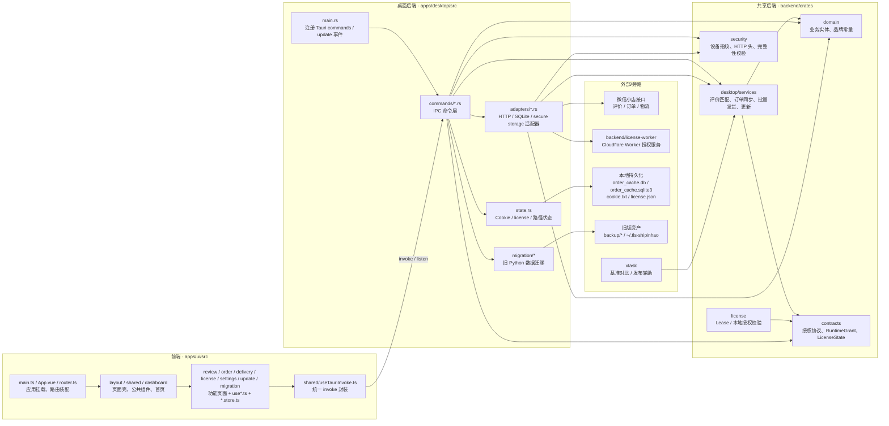

# TLS-shipinhao 前后端目录职责图

> 基于当前主运行链路静态梳理：`apps/ui` → `apps/desktop` → `backend/**`，并补充授权 Worker、旧版迁移与离线工具链。

## 一句话结论

- **前端不直连 HTTP**：`apps/ui/src` 统一通过 Tauri `invoke()/listen()` 调 `apps/desktop/src/commands/*.rs`。
- **桌面端是“前后端胶水层”**：`apps/desktop/src` 负责 IPC 命令、状态管理、远程 HTTP 适配、本地 SQLite / 文件落地。
- **核心业务沉到共享 Rust crate**：`crates/desktop-services`、`domain`、`contracts`、`security` 形成可复用后端能力。
- **授权链路是旁路后端**：桌面端 `license` 命令经 `http_license_client.rs` 调 `backend/license-worker`（Cloudflare Worker）。
- **类型契约目前主要靠“手工镜像”维持**：前端 `*.types.ts` 与后端 `domain/contracts` 结构对齐，但不是自动生成。

## 目录职责图

## 目录职责与依赖拆解

| 目录 | 职责 | 主要依赖 | 典型文件 |
|---|---|---|---|
| `apps/ui/src` | Vue 3 前端；页面、状态、路由、Tauri IPC 调用入口 | `@tauri-apps/api`、Pinia、Vue Router | `main.ts`, `router.ts`, `shared/useTauriInvoke.ts` |
| `apps/ui/src/review` | 评价匹配 / 品退匹配 UI；会联动订单缓存与发货草稿 | `find_reviews`, `find_quality_refund_orders`, `useOrder`, `delivery.store` | `useReview.ts`, `ReviewMatchView.vue` |
| `apps/ui/src/order` | 订单缓存列表、状态、同步进度事件监听 | `load_order_cache`, `get_order_cache_status`, `sync_recent_order_cache` | `useOrder.ts`, `order.store.ts` |
| `apps/ui/src/delivery` | 单条 / 批量发货 UI | `update_delivery`, `batch_delivery` | `useDelivery.ts`, `DeliveryView.vue` |
| `apps/ui/src/license` | 授权状态、激活、校验 | `activate_license`, `verify_license`, `get_license_status` | `useLicense.ts` |
| `apps/ui/src/settings` | Cookie 配置、目录选择、登录窗提取 | `system.rs` 命令组 | `SettingsView.vue` |
| `apps/ui/src/update` / `migration` / `dashboard` | 版本更新、旧版迁移提示、首页总览 | `check_for_update`, `start_legacy_migration`, `get_app_info` | `UpdateBanner.vue`, `MigrationBanner.vue`, `DashboardView.vue` |
| `apps/desktop/src/commands` | 前后端边界；把前端命令转换成领域调用 | `state`, `adapters`, `desktop-services`, `security_core` | `review.rs`, `order.rs`, `delivery.rs`, `license.rs`, `system.rs` |
| `apps/desktop/src/adapters` | 对接微信接口、授权接口、本地 SQLite、系统密钥环 | `reqwest`, `rusqlite`, `security_core` | `http_review_source.rs`, `http_order_search.rs`, `http_delivery_gateway.rs`, `http_license_client.rs`, `sqlite_order_cache.rs` |
| `apps/desktop/src/state.rs` | 运行态 Cookie / License / 路径记忆；文件落地 | `desktop_services::parse_cookie_profile` | `state.rs` |
| `apps/desktop/src/migration` | 从旧 Python 客户端目录迁移缓存、Cookie、授权、配置指针 | 本地文件系统、旧目录 | `legacy_python.rs` |
| `crates/desktop-services` | 纯业务层；订单同步规划、评价匹配评分、批量发货、更新判定 | `domain-core`, `api-contracts` | `review/*`, `order/*`, `delivery/*`, `update/service.rs` |
| `crates/domain-core` | 业务实体与品牌常量 | 无 workspace 内部依赖 | `lib.rs`, `brand.rs` |
| `backend/api-contracts` | 授权协议、运行时授权契约 | 无 workspace 内部依赖 | `lib.rs` |
| `crates/security-core` | 设备指纹、请求头、完整性校验 | `sha2`, `ed25519-dalek` | `device_id.rs`, `http_headers.rs`, `integrity.rs` |
| `backend/license-service` | 授权租约、签名、本地校验逻辑 | `api-contracts` | `lib.rs`, `lease.rs`, `local_verify.rs` |
| `backend/license-worker` | 云侧授权服务端；桌面端授权 HTTP 终点 | `license-service`, `api-contracts` | `src/lib.rs` |
| `tools/xtask` | 用真实快照做匹配基准、生成发布产物 | `desktop-services` | `infra/tooling/xtask/src/bench_match.rs` |
| `backup/` | 旧 Python 资产备份，不参与当前主运行链路，只作为迁移来源/对照物 | 无 | `backup/legacy-*` |

## 前后端“按功能”依赖对照

| 前端功能目录 | Tauri 命令 | 桌面适配/状态 | 共享业务 / 远端依赖 |
|---|---|---|---|
| `review/` | `commands/review.rs` | `http_review_source.rs`、`http_quality_refund_source.rs`，并复用 `commands/order.rs` 的缓存进度事件 | `desktop/services/review/*` + `desktop/services/order/*` + 微信评价/品退接口 |
| `order/` | `commands/order.rs` | `http_order_search.rs`、`sqlite_order_cache.rs` | `desktop/services/order/*` + 本地 SQLite |
| `delivery/` | `commands/delivery.rs` | `http_delivery_gateway.rs` | `desktop/services/delivery/*` + 微信物流接口 |
| `license/` | `commands/license.rs` | `http_license_client.rs`、`state.rs` | `security_core` + `backend/license-worker` |
| `settings/` | `commands/system.rs` | `state.rs`、登录 WebView、Cookie 文件 | 本地文件系统 |
| `update/` | `commands/system.rs` / `main.rs` | 更新事件发射 | `desktop/services/update/service.rs` + 远程 `version.json` |
| `migration/` | `commands/system.rs` | `migration/legacy_python.rs` | 旧版目录 `~/.tls-shipinhao` / `backup/*` |
| `dashboard/` | `commands/system.rs` | 读取品牌与运行时信息 | `domain::brand` |

## 当前真实主链路

### 1. 运行与构建链路

- `apps/desktop/tauri.conf.json` 指定：
  - `beforeDevCommand = pnpm --filter tls-shipinhao-ui dev`
  - `frontendDist = ../ui/dist`
- 说明 **桌面壳依赖前端构建产物**，当前正式 UI 入口是 `apps/ui`，不是 `apps/desktop` 的 Slint 壳。

### 2. 前端到后端通信链路

- `apps/ui/src/shared/useTauriInvoke.ts` 封装所有 `invoke(command, args)`。
- `apps/ui/src/order/useOrder.ts` 还额外监听 `order-sync-progress` 事件。
- 因此 **前端与后端的边界非常清晰：只有 Tauri IPC，没有 axios/fetch 直连业务接口**。

### 3. 后端内部调用链

- `apps/desktop/src/main.rs` 统一注册命令。
- `commands/*.rs` 做参数接收、授权判断、状态读取、线程切换（`spawn_blocking`）。
- `adapters/*.rs` 负责“访问外部世界”：微信接口、授权接口、本地 SQLite、系统能力。
- `crates/desktop-services` 负责“纯业务规则”：评分匹配、缓存规划、批量发货、更新判定。
- `crates/domain-core` / `contracts` / `security` 提供可复用底层契约与安全能力。

## 需要特别注意的耦合点

1. **前端类型与 Rust 契约是手工镜像，不是代码生成**  
   - 例如 `apps/ui/src/shared/brand.ts` ↔ `crates/domain-core/src/brand.rs` 语义重复。  
   - `apps/ui/src/review/review.types.ts`、`order/order.types.ts`、`delivery/delivery.types.ts` 分别镜像 `domain-core` 里的结构。  
   - `apps/ui/src/license/license.types.ts` 镜像 `api-contracts` 的授权状态集合。  
   - 这意味着 **改 Rust 字段名/枚举值时，需要同步改前端 TS 类型与 UI 分支**。

2. **Review 模块依赖 Order 模块，不是孤立功能**  
   - `review/useReview.ts` 会调用 `useOrder()` 的 `withSyncEvents / loadRecentCache / loadCacheStatus`。  
   - `commands/review.rs` 在缓存覆盖不足时会触发订单补抓，再做评价匹配。  
   - 所以“评价匹配”本质上依赖“订单缓存能力”。

3. **License 是旁路后端，不在桌面进程内闭环**  
   - UI 调 `commands/license.rs`。  
   - `commands/license.rs` 再调 `http_license_client.rs`。  
   - 最终请求 `backend/license-worker` 暴露的 `/api/activate`、`/api/verify` 等接口。  
   - 因此授权链路改动通常要同时看桌面端与 Worker。

4. **当前仓库存在一个非主链路的 Slint 桌面壳**  
   - `apps/desktop` 依赖 `desktop-services`，但它是单独的 Slint shell。  
   - 结合 `README.md` 与 `apps/desktop/tauri.conf.json`，当前正式运行入口仍是 `apps/desktop` + `apps/ui`。

## 本次梳理主要依据的文件

- 前端入口：`apps/ui/src/main.ts`, `apps/ui/src/router.ts`, `apps/ui/src/shared/useTauriInvoke.ts`
- 前端功能：`apps/ui/src/review/useReview.ts`, `apps/ui/src/order/useOrder.ts`, `apps/ui/src/delivery/useDelivery.ts`, `apps/ui/src/license/useLicense.ts`, `apps/ui/src/settings/SettingsView.vue`, `apps/ui/src/update/UpdateBanner.vue`, `apps/ui/src/migration/MigrationBanner.vue`, `apps/ui/src/dashboard/DashboardView.vue`
- 桌面入口：`apps/desktop/src/main.rs`, `apps/desktop/tauri.conf.json`
- 桌面命令：`apps/desktop/src/commands/*.rs`
- 桌面适配：`apps/desktop/src/adapters/*.rs`, `apps/desktop/src/state.rs`, `apps/desktop/src/migration/legacy_python.rs`
- 共享后端：`crates/desktop-services/src/*`, `crates/domain-core/src/*`, `backend/api-contracts/src/lib.rs`, `crates/security-core/src/*`, `backend/license-service/src/lib.rs`
- 授权旁路：`backend/license-worker/src/lib.rs`
- 工具链：`tools/xtask/src/bench_match.rs`
